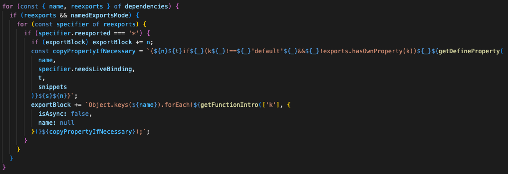
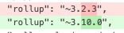

# 引入vue的createSSRApp方法报错

今天在 vue官网试验ssr, https://vuejs.org/guide/scaling-up/ssr.html#rendering-an-app

结果使用 `node example.js` 执行报错

```
import { createSSRApp } from 'vue'
         ^^^^^^^^^^^^
SyntaxError: The requested module 'vue' does not provide an export named 'createSSRApp'
```
node现在type: "module", 可以使用import, 之前版本用require引入模块  
看了下`vue/dist/vue.cjs.js` 最后rollup编译生成代码
```javascript
exports.compile = compileToFunction;
for (var k in runtimeDom) {
  if (k !== 'default' && !exports.hasOwnProperty(k)) exports[k] = runtimeDom[k];
}
```

其中vue中 `packages/vue/src/runtime.ts` 源码, 这样写的
```javascript
export * from '@vue/runtime-dom'
```

为此, rollup作者提交的特性
`Use old namespace reexport code pattern for better Node named export sniffing`
https://github.com/rollup/rollup/pull/4826

源代码改动`rollup/src/finalisers/shared/getExportBlock.ts`


这样就会编译生成这样的代码
```javascript
Object.keys(runtimeDom).forEach(function (k) {
  if (k !== 'default') exports[k] = runtimeDom[k];
});
```
vue后面也升级了rollup



思考: 根本原因nodejs的module模式, v18.16.0版本目前还分析不出不出for in的cjs导出, 但能分析出Object.keys的?